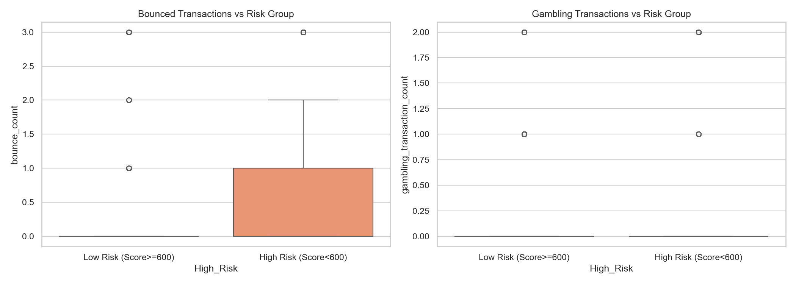
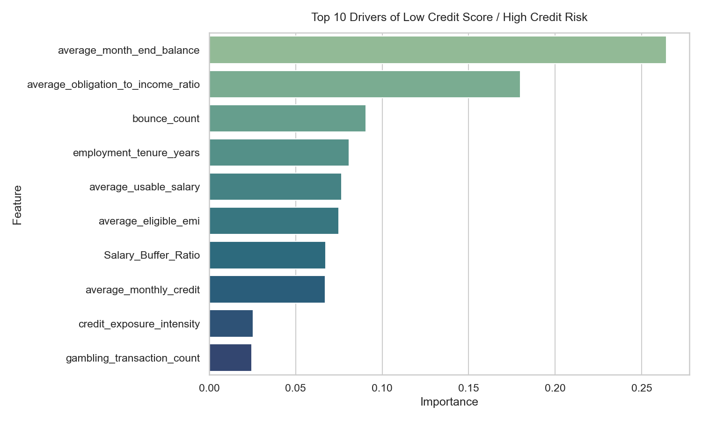
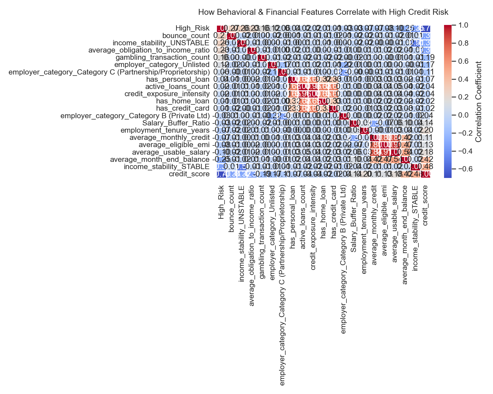
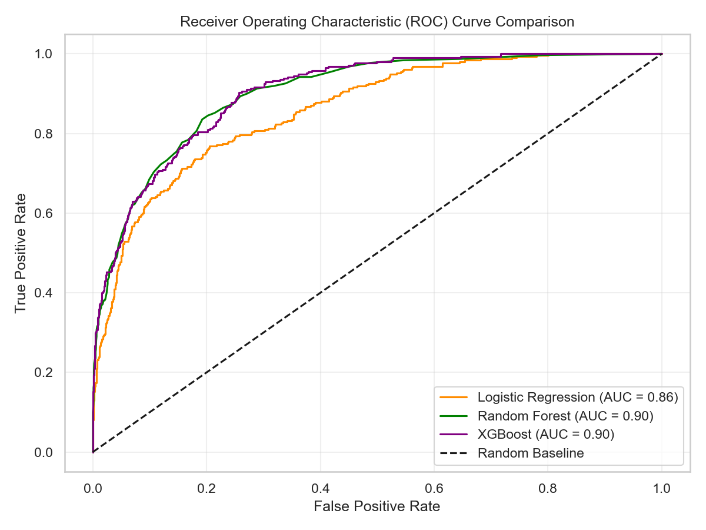
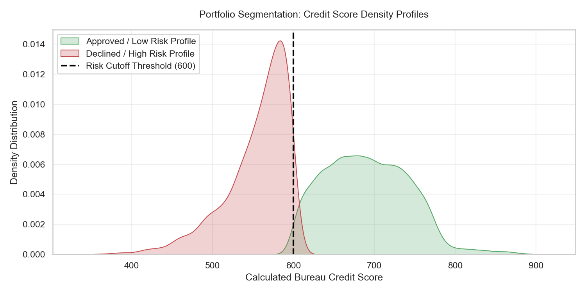

# Banking Credit Risk Underwriting Scorecard Engine

An end-to-end machine learning underwriting pipeline built on consumer credit histories. This project develops a credit scorecard system that shifts away from generic metrics to target automated binary risk evaluation and portfolio loss minimization.

---

##  Core Portfolio Risk Drivers

Before building the models, we analyzed the clear behavioral patterns separating low-risk applicants from high-risk defaults:

* **Key Insight:** Delinquency patterns are heavily non-linear. Individuals with regular past-due occurrences show a massive increase in baseline default rates.

---

## ⚡ Feature Architecture & Importance

Using a Random Forest ensemble model, we calculated the structural importance of each client vector to identify what truly drives a bad credit classification:

### Risk Telemetry Matrices
To map how tightly these behaviors move together, we engineered a global portfolio correlation matrix:

---

##  Machine Learning Benchmarks & Model Separation

We built a champion-challenger framework using multiple algorithms to test out-of-sample data. Performance is measured using ROC-AUC and the **Regulatory Gini Index** ($2 \times \text{AUC} - 1$), which is the industry standard for risk committee validation.

### Model Metric Summary
* **Logistic Regression (Baseline):** AUC: **0.8600** | Gini: **0.7201**
* **Random Forest (Challenger):** AUC: **0.9017** | Gini: **0.8035**

### Portfolio Credit Score Distribution
Our internal `prob_to_score` translation function safely scales individual risk percentages back to a traditional 300–850 credit scorecard metric:

## Performance Matrix & Model Benchmarks

A challenger model framework was evaluated using a stratified 20% validation split. The models achieved the following out-of-sample performance:

| Engine Variant | Validation ROC-AUC | Regulatory Gini Index | Operational Deployment Status |
| :--- | :---: | :---: | :--- |
| **XGBoost Classifier** | **0.9037** | **0.8073** | **Production Champion** |
| Random Forest | 0.9017 | 0.8035 | Core Challenger |
| Logistic Regression | 0.8600 | 0.7201 | Baseline Interpretation |
---

##  Commercial Loss Optimization Loop

Traditional models assume a 50% classification threshold is optimal. In banking, a **False Negative** (approving someone who defaults) costs significantly more ($5,000 principal write-off) than a **False Positive** (rejecting a safe applicant, costing a $500 margin).

By testing thresholds against our operational cost equation, the engine found that a strict **10% probability cutoff** minimizes total business exposure:

* **Threshold 50%:** Total Misclassification Cost = **$976,000**
* **Threshold 10% (Optimized):** Total Misclassification Cost = **$386,000**

---

##  Deployment Strategy Mandates
1. **Automated Approvals:** Instantly pass any applicant scoring above **550** on the engineered scorecard.
2. **Dynamic Risk Scale-Down:** Automatically reduce credit limits by 25% for every additional late payment flag recorded on an active ledger.
3. **Loss Mitigation:** Deploy at the **10% risk probability cutoff** to save the institution over **$590,000** in unoptimized portfolio write-offs.
